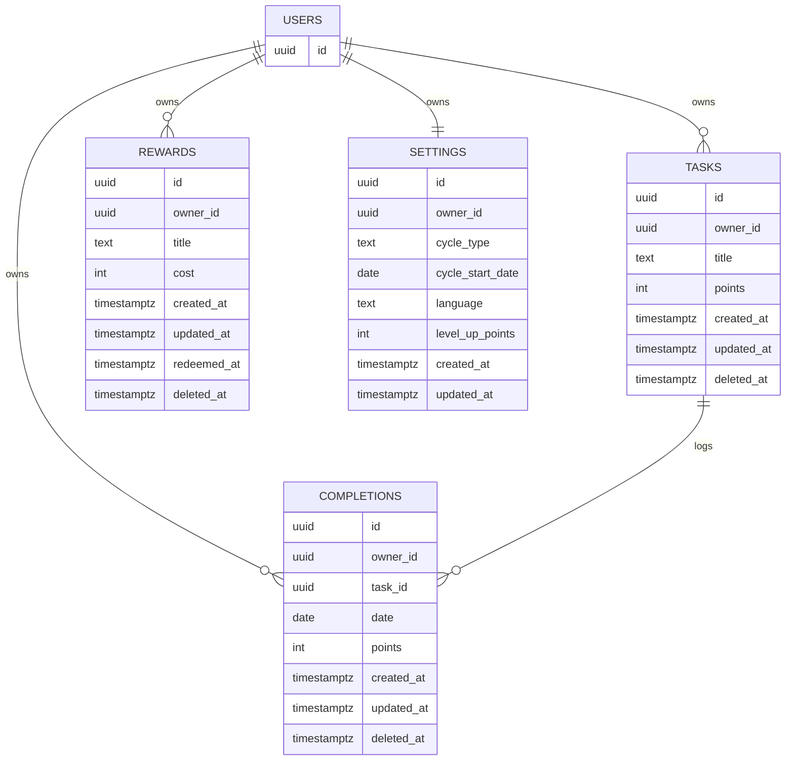

```mermaid
erDiagram
  USERS ||--o{ TASKS : owns
  USERS ||--o{ REWARDS : owns
  USERS ||--o{ COMPLETIONS : owns
  USERS ||--|| SETTINGS : owns

  TASKS ||--o{ COMPLETIONS : logs

  USERS {
    uuid id
  }

  TASKS {
    uuid id
    uuid owner_id
    text title
    int points
    timestamptz created_at
    timestamptz updated_at
    timestamptz deleted_at
  }

  REWARDS {
    uuid id
    uuid owner_id
    text title
    int cost
    timestamptz created_at
    timestamptz updated_at
    timestamptz redeemed_at
    timestamptz deleted_at
  }

  COMPLETIONS {
    uuid id
    uuid owner_id
    uuid task_id
    date date
    int points
    timestamptz created_at
    timestamptz updated_at
    timestamptz deleted_at
  }

  SETTINGS {
    uuid id
    uuid owner_id
    text cycle_type
    date cycle_start_date
    text language
    int level_up_points
    timestamptz created_at
    timestamptz updated_at
  }
```
