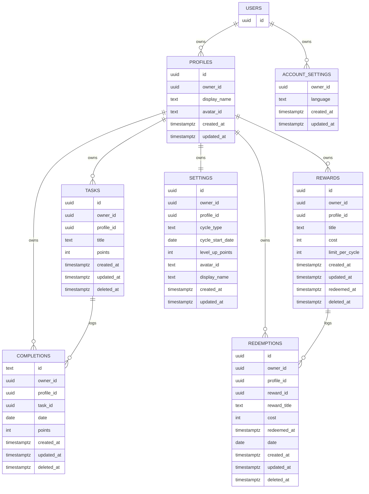

```mermaid
erDiagram
  %% language: en, pt, fr
  USERS ||--o{ PROFILES : owns
  USERS ||--o{ ACCOUNT_SETTINGS : owns
  PROFILES ||--o{ TASKS : owns
  PROFILES ||--o{ REWARDS : owns
  PROFILES ||--o{ REDEMPTIONS : owns
  PROFILES ||--o{ COMPLETIONS : owns
  PROFILES ||--|| SETTINGS : owns

  TASKS ||--o{ COMPLETIONS : logs
  REWARDS ||--o{ REDEMPTIONS : logs

  USERS {
    uuid id
  }

  PROFILES {
    uuid id
    uuid owner_id
    text display_name
    text avatar_id
    timestamptz created_at
    timestamptz updated_at
  }

  ACCOUNT_SETTINGS {
    uuid owner_id
    text language
    timestamptz created_at
    timestamptz updated_at
  }

  TASKS {
    uuid id
    uuid owner_id
    uuid profile_id
    text title
    int points
    timestamptz created_at
    timestamptz updated_at
    timestamptz deleted_at
  }

  REWARDS {
    uuid id
    uuid owner_id
    uuid profile_id
    text title
    int cost
    int limit_per_cycle
    timestamptz created_at
    timestamptz updated_at
    timestamptz redeemed_at
    timestamptz deleted_at
  }

  REDEMPTIONS {
    uuid id
    uuid owner_id
    uuid profile_id
    uuid reward_id
    text reward_title
    int cost
    timestamptz redeemed_at
    date date
    timestamptz created_at
    timestamptz updated_at
    timestamptz deleted_at
  }

  COMPLETIONS {
    text id
    uuid owner_id
    uuid profile_id
    uuid task_id
    date date
    int points
    timestamptz created_at
    timestamptz updated_at
    timestamptz deleted_at
  }

  SETTINGS {
    uuid id
    uuid owner_id
    uuid profile_id
    text cycle_type
    date cycle_start_date
    int level_up_points
    text avatar_id
    text display_name
    timestamptz created_at
    timestamptz updated_at
  }
```
